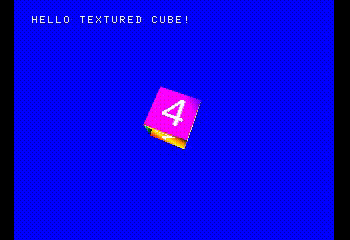
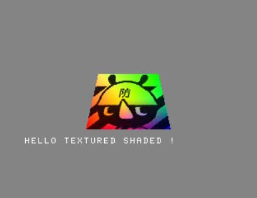

# Nolibgs Hello Worlds !

<p align="center">






</p>

So you want to begin developping on the original PSX but don't know where to start ?

This repo is destined to host a bunch of simple examples, each describing how to do one thing.

The code here will be using PsyQ, the "Official" Sony SDK, but we will not be using libGS, the Extended Graphics Library for the graphic stuff...

Instead we'll try to devise methods to reproduce libgs functions. This will not necessarly be more efficient, but we'll learn
a lot more stuff !

 
## Setting up the SDK : Modern GCC + PsyQ a.k.a Nugget+PsyQ

For this we'll rely heavily on [grumpy-coder](https://github.com/grumpycoders/pcsx-redux)'s work with pcsx-redux and various tools, which will provide us with:

  * A way to compile the code with a modern version of GCC
  * An emulator with a lot of debugging features
  
### Let's do it !

  * On MacOs, a brew installation script can be found [here.](https://github.com/grumpycoders/pcsx-redux#macos)
  
  * On windows, install WSL2 and Debian then launch a GNU/Linux terminal, then proceed with the following instructions.  
  
  Alternatively, you can skip steps 1 and 3, get the latest precompiled toolchain from here : [http://static.grumpycoder.net/pixel/mips/](http://static.grumpycoder.net/pixel/mips/),  
  unzip it somewhere and [add the `bin` folder to your PATH](https://stackoverflow.com/questions/44272416/how-to-add-a-folder-to-path-environment-variable-in-windows-10-with-screensho#44272417).  
  Then go on with steps 4 and 5.

  1. Install the needed software packages ( aka dependencies in Linux world ) :  
  
   * To be able to build PsyQ code, you only need the MIPS toolchain :  
   
```bash
sudo apt-get install gcc-mipsel-linux-gnu g++-mipsel-linux-gnu binutils-mipsel-linux-gnu
```
   * If you want to compile pcsx-redux, you need a few more packages :  
   
```bash
sudo apt-get install -y git make pkg-config clang g++ libavcodec-dev libavformat-dev libavutil-dev libglfw3-dev libsdl2-dev libswresample-dev libuv1-dev zlib1g-dev
```

  2. Clone the pcsx-redux repo : 
  
```bash
git clone https://github.com/grumpycoders/pcsx-redux.git --recursive
```
  
  3. Compile pcsx-redux : 
  
```bash 
make -C pcsx-redux
```

If you encounter an error due to an old version of GCC (< 10) like something about `-fcoroutines`, then you can use **clang** to compile `pcsx-redux` :

```bash

CC=clang CXX=clang++ LD=clang++ make -C pcsx-redux
```
  
  4. Get the converted PsyQ 4.7 libs : 
  
```bash
wget http://psx.arthus.net/sdk/Psy-Q/psyq-4.7-converted-full.7z
```
  
  5. Extract this archive to `[...]pcsx-redux/src/mips/psyq/`, adapting the path  in the command below to the folder you cloned pcsx-redux in :

```bash
7z x -o/pcsx-redux/src/mips/psyq/
```

Your `pcsx-redux/src/mips/psyq/` directory should not contain an `include` and a `lib` folder with a bunch of files in each of them :
    
```bash 
$tree /pcsx-redux/src/mips/psyq/
.
├── include
│   ├── abs.h
│   ├── ...
│   ├── strings.h
│   └── sys
│       ├── errno.h
│       ├── ...
│       └── types.h
├── lib
│   ├── libapi.a
│   ├── ...
│   └── libtap.a
└── tree

3 directories, 82 files
```
  
  6. That's it ! After that you can check everything's working byt trying to compile some example code :
  
```bash 
cd pcsx-redux/src/mips/psyq/cube
make 
```

You should know have a 'cube.ps-exe' file in the folder. This is a PSX executable you can load with most emulators.


## Embedding binary data in a ps-exe

So, if you don't know it yet, the fun in PSX development is to be able to upload your exes on real hardware with a USB/Serial cable.
This means that the data you'll use in your program ( graphics, sounds, etc.) will have to be embedded in your exe in a binary form, 
as you won't be able to stream them from the serial port. 

*Well technically you could load them in memory before uploading your exe or stream them from a cd, but let's keep things simple for now.*

With our setup, this is quite easy !

  1. In `pcsx-redux/src/mips/common.mk` , add the lines :
  
  ```mk
# convert TIM file to bin
%.o: %.tim
    $(PREFIX)-objcopy -I binary --set-section-alignment .data=4 --rename-section .data=.rodata,alloc,load,readonly,data,contents -O elf32-tradlittlemips -B mips $< $@

# convert VAG files to bin
%.o: %.vag
    $(PREFIX)-objcopy -I binary --set-section-alignment .data=4 --rename-section .data=.rodata,alloc,load,readonly,data,contents -O elf32-tradlittlemips -B mips $< $@
```

If you pay attention, you can see that's the same command, but for different file types. TIM files are bitmap images and VAG is the sound format used in this example.
Each time you'll want to add a file type, just duplicate and change `%.vag` to `%.filetype`

Then, in your project folder, copy the makefile from the cube example :

```bash
mkdir new_project && cd new_project
cp ../cube/Makefile ../
```

All you have to do now is add the files you wish to embed to the SRCS variable, without forgetting the \ :

```bash
SRCS = main.c \
../common/crt0/crt0.s \
file_to_embed.ext \
```

  2. So this part takes care of converting our data to binary. Now to access them from your program, just use this in your sources :
```c
extern ulong _binary_filename_extension_start[]; 
extern ulong _binary_filename_extension_end[];
extern ulong _binary_bowsht_tim_length[];
```

The filename variable must begin with `_binary_` followed by the full path of your file, with . and / replaced by _ (underscore), and end with `_start[];` or `_end[];` or `_length[];` [source](https://discord.com/channels/642647820683444236/663664210525290507/780866265077383189)

`_start` and `_end` are pointers, while `_length` is a constant.

That's it! When you'll type `make` next time, it should convert your files to .o, then include them in your ps-exe.

## Compiling the examples in this repo

All you have to do is uncomment the corresponding rules in `Makefile` then compile with `make`.

# Links and Doc

  * [Getting started with PSX dev](https://psx.arthus.net/starting.html)
  * [PsyQ docs](http://psx.arthus.net/sdk/Psy-Q/DOCS/)
  * [Ps1 dev links](https://ps1.consoledev.net/)
  * [psxdev.net](http://psxdev.net/)
  * [psxdev Discord](https://discord.com/invite/N2mmwp?utm_source=Discord%20Widget&utm_medium=Connect)

# Credits, thanks, hugs

Everything here was learnt from some more talented persons, mainly but not excluding others that hang around on the [psxdev discord](https://discord.com/channels/642647820683444236/642848627823345684)
Nicolas Noble, Lameguy64, NDR008, Jaby smoll seamonstah, danhans42, rama, sickle, paul, squaresoft74, and lot mores !
